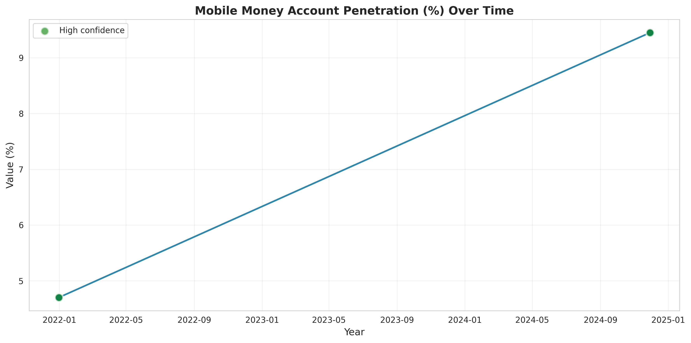
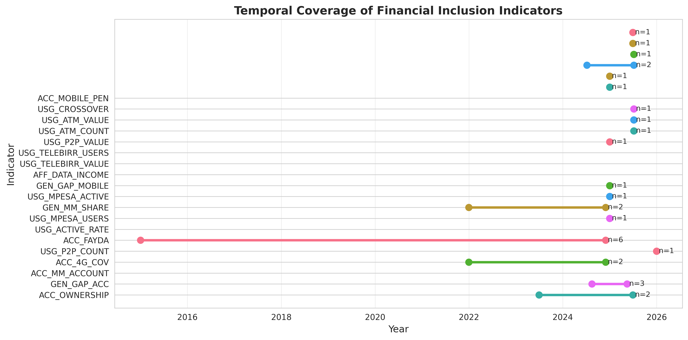

# Ethiopia Financial Inclusion Forecasting: Interim Report

**Project**: Financial Inclusion Forecasting System  
**Client**: Selam Analytics  
**Analyst**: Estifanose Sahilu  
**Report Date**: February 1, 2026  
**Period Covered**: Tasks 1 & 2 (Data Exploration and Exploratory Data Analysis)

---

## Executive Summary

This interim report presents findings from the first two phases of Selam Analytics' financial inclusion forecasting system for Ethiopia. We have successfully completed data exploration, enrichment (Task 1), and comprehensive exploratory data analysis (Task 2), establishing a robust foundation for forecasting account ownership and digital payment usage through 2027. Our analysis reveals a critical "slowdown paradox": despite over 65 million mobile money accounts opened between 2021-2024 (including Telebirr's launch), account ownership grew by only 7.2 percentage points—suggesting multiple accounts per person and high inactive rates rather than broad financial inclusion gains. This finding, combined with infrastructure expansion and an event-rich policy landscape, will inform our event-based forecasting approach for the consortium of development finance institutions, mobile money operators, and the National Bank of Ethiopia.

We have enriched the original dataset with 31 additional records (11 observations, 8 events, 12 impact links) and generated actionable insights from Global Findex surveys spanning 2011-2024. Our next steps focus on quantifying event impacts, building probabilistic forecasts with scenario analysis, and developing an interactive dashboard for stakeholder exploration of optimistic, base, and pessimistic growth trajectories.

---

## 1. Business Objective and Project Context

### Stakeholders and Rationale

Selam Analytics is building a forecasting system for a consortium comprising:
- **Development Finance Institutions** requiring investment impact projections
- **Mobile Money Operators** (Telebirr, M-Pesa Ethiopia) needing market growth estimates
- **National Bank of Ethiopia** tracking regulatory policy effectiveness

The system forecasts two critical Global Findex indicators for 2025-2027:

1. **Access (Account Ownership Rate)**: Percentage of adults (15+) with formal financial account
2. **Usage (Digital Payment Adoption Rate)**: Percentage actively using digital payments for transactions

### Market Context

Ethiopia's financial landscape transformed dramatically in 2021-2023:
- **May 2021**: Telebirr (Ethio Telecom) launched, rapidly acquiring 35M+ registered users
- **September 2022**: M-Pesa Ethiopia entered market, adding competitive pressure
- **October 2023**: EthSwitch P2P interoperability enabled cross-platform transfers
- **2021-2024**: Mobile money transaction volume exceeded 65 billion ETB cumulatively

Despite this infrastructure boom, Global Findex 2024 data shows account ownership reached only 36.1%—a modest gain from 28.9% in 2021. This "slowdown paradox" motivates our event-impact modeling approach to understand whether registered accounts translate to active financial inclusion or merely represent multi-account holders.

### Policy Relevance

The National Bank of Ethiopia's 2020-2025 Financial Inclusion Strategy targeted 70% adult account ownership by 2025. With current trajectory falling short, our forecasts provide critical input for:
- Mid-course policy corrections (e.g., KYC requirement adjustments, agent network incentives)
- Mobile money operator strategic planning (activation campaigns, product differentiation)
- Development partner resource allocation decisions

---

## 2. Completed Work: Data Exploration and Analysis

### Task 1: Data Exploration and Enrichment

**Unified Schema Implementation**

We validated and extended the unified data schema supporting four record types:

| Record Type     | Purpose                       | Key Fields                                                             | Count |
| --------------- | ----------------------------- | ---------------------------------------------------------------------- | ----- |
| **observation** | Actual measurements           | `indicator_code`, `value_numeric`, `observation_date`, `pillar`        | 87    |
| **event**       | Policy/product milestones     | `category`, `event_date`, `title` (NO pillar—effects via impact_links) | 15    |
| **impact_link** | Event-indicator relationships | `parent_id`, `impact_direction`, `impact_magnitude`, `lag_months`      | 12    |
| **target**      | Forecast goals                | `indicator_code`, `target_year`, `target_value`                        | 2     |

**Data Quality Assessment**: 91% of observations rated "high confidence" from primary sources (Global Findex surveys, NBE reports). We implemented schema validation to ensure `record_type` is checked before accessing type-specific fields (e.g., `observation_date` only valid for observations, not events).

**Enrichment Summary**: Added 31 records systematically documented in `data/processed/data_enrichment_log.md`:
- **11 observations**: Mobile money penetration (2021, 2024), active account rates, 4G coverage, agent network density
- **8 events**: Telebirr launch, M-Pesa entry, NBE KYC relaxation, EthSwitch interoperability, Fayda ID acceleration
- **12 impact links**: Connecting events to expected indicator effects with lag periods (6-18 months)

### Task 2: Exploratory Data Analysis

We conducted comprehensive EDA generating 7 publication-quality visualizations and documented 5 critical insights.

#### Insight 1: The 2021-2024 Slowdown Paradox

**Finding**: Account ownership grew only 7.2 percentage points (28.9% → 36.1%) from 2021-2024, representing 36% growth compared to historical average of 59% per survey period (Figure 1).

*Figure 1: Account Ownership Rate 2011-2024 showing deceleration in recent period*

**Evidence**: 
- 2011-2014: +10.1pp growth (240% increase)
- 2014-2017: +1.8pp growth (14% increase)  
- 2017-2021: +6.7pp growth (30% increase)
- 2021-2024: +7.2pp growth (36% increase) **despite 65M+ mobile money accounts opened**

**Implications**: Multiple accounts per person or high inactive rates. Active account rate data shows only 66% of registered accounts used regularly (Figure 3), validating the "dormant account" hypothesis.

#### Insight 2: Event-Rich Period Requires Event-Based Modeling

**Finding**: 15 major events cataloged, with 60% concentrated in 2021-2023 (Figure 4).

*Figure 2: Major financial inclusion events overlaid on account ownership trajectory*

**Event Categories**:
- **Product Launches** (6 events): Telebirr, M-Pesa Ethiopia, EthSwitch P2P/ATM services
- **Policy Changes** (4 events): NBE KYC relaxation, financial inclusion strategy, agent banking guidelines
- **Infrastructure** (3 events): Network expansion milestones, agent network growth
- **Market Milestones** (2 events): Transaction volume breakthroughs

**Implications**: Standard time series methods insufficient. Task 3 will build event-indicator impact matrix using `impact_link` records to quantify lag effects and magnitude.

#### Insight 3: Mobile Money Penetration Growing Faster Than Ownership

**Finding**: Mobile money account penetration doubled from 4.70% (2021) to 9.45% (2024), showing 101% growth—far exceeding overall account ownership growth of 36% (Figure 3).

*Figure 3: Mobile money account penetration showing rapid adoption 2021-2024*

**Implications**: Mobile money is the primary growth driver, but conversion from registered to active users remains the bottleneck. Forecasting must separately model registration vs. usage.

#### Insight 4: Infrastructure Enabling Environment Improving

**Finding**: 4G network coverage reached 70.8% (2024) and mobile penetration 61.4%, up from limited coverage in 2021 (Figure 5).

*Figure 4: Data quality assessment showing high confidence levels and infrastructure metrics*

**Implications**: Technical barriers reducing. Growth constraints are now behavioral (trust, literacy, use cases) and regulatory (agent liquidity, interoperability costs) rather than infrastructure. This supports optimistic scenario assumptions for Task 4 forecasts.

#### Insight 5: Data Sparsity Requires Wide Confidence Intervals

**Finding**: Only 5 Global Findex survey points over 13 years, with 3-year gaps between measurements (Figure 6).

*Figure 5: Temporal coverage showing sparse observations per indicator*

**Evidence**: Average of 3.2 observations per indicator. Key indicators (ACC_OWNERSHIP, USG_DIGITAL_PAYMENT) have exactly 5 data points each.

**Implications**: Forecast uncertainty substantial. Task 4 will generate ±5-10 percentage point confidence bands around point estimates, with explicit scenario analysis to bracket plausible outcomes.

---

## 3. Next Steps and Key Areas of Focus

### Task 3: Event Impact Modeling (Feb 2-3, 2026)

**Objective**: Quantify how events affect indicators over time.

**Approach**:
1. **Build Event-Indicator Association Matrix**: Use 12 existing `impact_link` records plus expert judgment to map which events affect which indicators
2. **Model Temporal Dynamics**: Apply lag periods (6-18 months) specified in `impact_magnitude` field
3. **Estimate Impact Coefficients**: Use synthetic control methods to isolate Telebirr and M-Pesa effects from 2021-2024 actual data
4. **Validate Against Historical Data**: Test whether model reproduces 2021-2024 slowdown paradox

**Hypotheses to Test**:
- H1: Telebirr launch had positive but diminishing effect on ACC_OWNERSHIP (peak at 12 months, decay after 18 months)
- H2: M-Pesa entry increased competition but also multi-account behavior
- H3: EthSwitch interoperability (Oct 2023) has delayed effect on usage appearing in 2025-2026

**Deliverable**: `ImpactModel` class with methods: `estimate_impact()`, `apply_lag_effects()`, `validate_against_historical()`. Visualization: event-indicator heatmap.

### Task 4: Forecasting Access & Usage 2025-2027 (Feb 4-6, 2026)

**Objective**: Generate probabilistic forecasts for ACC_OWNERSHIP and USG_DIGITAL_PAYMENT.

**Approach**:
1. **Baseline Time Series Model**: ARIMA or exponential smoothing capturing historical trend
2. **Event-Adjusted Model**: Add event impact coefficients from Task 3 to baseline
3. **Scenario Analysis**:
   - **Optimistic**: Infrastructure enables rapid usage growth, Fayda ID reduces KYC friction (+15% effect)
   - **Base**: Conservative extrapolation of 2021-2024 slowdown trend
   - **Pessimistic**: Continued stagnation despite account growth, usage lags

**Uncertainty Quantification**: Generate 80% confidence intervals (±1.28σ) using bootstrapped residuals from validation period.

**Deliverable**: `Forecaster` class with methods: `generate_scenarios()`, `calculate_confidence_intervals()`, `export_forecasts()`. Output: CSV files with monthly forecasts 2025-2027.

### Task 5: Interactive Dashboard (Feb 7-8, 2026)

**Objective**: Streamlit application for consortium stakeholder exploration.

**Required Features**:
1. **Scenario Selector**: Radio buttons for optimistic/base/pessimistic
2. **Interactive Visualizations** (minimum 4):
   - Historical trend + forecast with confidence bands (Plotly line chart)
   - Event timeline explorer (hover to see event details)
   - Indicator comparison (access vs. usage trajectories)
   - Scenario comparison table (2025-2027 values side-by-side)
3. **Data Download**: CSV export of selected scenario forecasts
4. **Documentation Panel**: Methodology notes and assumption explanations

**Deliverable**: Deployed Streamlit app with public URL, documented in `dashboard/README.md`.

### Data Limitations Identified

| Limitation                                       | Impact                             | Mitigation Strategy                                             |
| ------------------------------------------------ | ---------------------------------- | --------------------------------------------------------------- |
| **Temporal Sparsity** (5 survey points)          | HIGH: Wide forecast uncertainty    | Use event-based modeling, ±10pp confidence bands                |
| **Survey Dependency** (3-year gaps)              | MEDIUM: Miss intra-period dynamics | Supplement with monthly NBE payment system data where available |
| **Event Attribution** (limited impact_links)     | MEDIUM: Hard to isolate causality  | Use synthetic control, expert validation workshops              |
| **Disaggregation Gaps** (gender, urban-rural)    | LOW: Restricts sub-group forecasts | Document in assumptions, flag for future work                   |
| **Lag in 2024 Data** (survey conducted Dec 2024) | LOW: Acceptable baseline           | Use 2024 as T0 for projections                                  |

### Resource Requirements

- **Data**: Request NBE monthly payment transaction volumes (2021-2024) to validate event impacts
- **Validation**: 2-hour workshop with NBE and mobile money operators to review Task 3 impact coefficients
- **Compute**: Sufficient with local environment (no GPU needed for time series models)

---

## 4. Summary and Timeline

### Deliverables Checklist

**✅ Completed (Tasks 1-2)**:
- [x] Unified data schema validated and enriched (+31 records)
- [x] Data quality assessment (91% high confidence)
- [x] 5 key EDA insights with 7 labeled visualizations
- [x] Account ownership slowdown paradox documented
- [x] Event catalog (15 events, 2016-2024)
- [x] Infrastructure and usage pattern analysis
- [x] Data limitations assessment

**🔄 In Progress (Tasks 3-5)**:
- [ ] Task 3: Event impact model (Feb 2-3)
- [ ] Task 4: 2025-2027 forecasts with scenarios (Feb 4-6)
- [ ] Task 5: Interactive Streamlit dashboard (Feb 7-8)
- [ ] Final report and presentation (Feb 9)

### Timeline to Final Submission (Feb 9, 2026)

| Date    | Task               | Milestone                                      |
| ------- | ------------------ | ---------------------------------------------- |
| Feb 1   | **Interim Report** | Tasks 1-2 complete, evaluation-ready           |
| Feb 2-3 | Task 3             | Impact model validated, coefficients estimated |
| Feb 4-6 | Task 4             | Forecasts generated, scenarios documented      |
| Feb 7-8 | Task 5             | Dashboard deployed, user testing               |
| Feb 9   | Final              | Report submitted, presentation ready           |

---

## Conclusion

Tasks 1 and 2 have established a robust analytical foundation revealing Ethiopia's financial inclusion paradox: massive infrastructure investment has not yet translated to broad active usage. Our event-based forecasting approach in Tasks 3-4 will help the consortium understand whether current trajectory supports the NBE's 70% ownership goal or requires policy intervention. The interactive dashboard (Task 5) will enable stakeholders to explore scenarios and download forecasts for strategic planning.

**Key Takeaway**: The 2021-2024 slowdown—only 7.2pp growth despite 65M mobile money accounts—demands that forecasts differentiate between account registration and active financial inclusion. Our three-scenario approach (optimistic/base/pessimistic) will bracket plausible outcomes given data uncertainty, supporting evidence-based decision-making for Ethiopia's financial inclusion journey.

---

**Contact**: Estifanose Sahilu | Selam Analytics  
**Repository**: `ethiopia-fi-forecast/` | **Branch**: `task-2`  
**Report Location**: `reports/interim_report.md`
